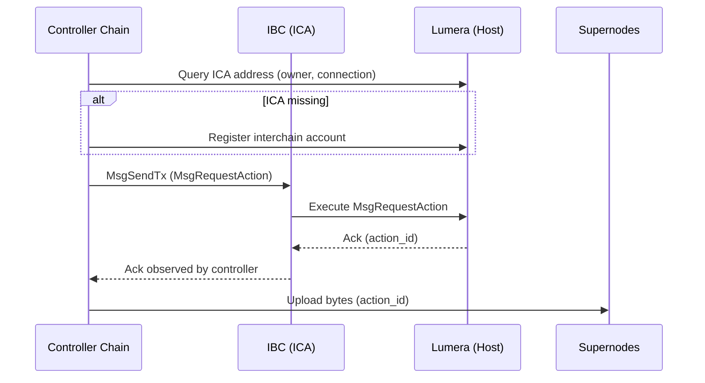

# Developer Guide

This guide documents how `lumera-ica-client` registers Cascade actions through ICA,
how to configure `config.toml`, and how each CLI command maps to code.

## Architecture and ICA Flow

The client operates across two chains:

- **Controller chain**: where the user key lives and signs ICA txs.
- **Host chain (Lumera)**: where Cascade actions are registered and executed.

The controller chain submits an ICS-27 `MsgSendTx` that carries a Lumera
`MsgRequestAction` (or `MsgApproveAction`). The host chain executes that message,
producing an acknowledgement that the controller chain observes.

Mermaid diagram:



ASCII diagram:

```
Controller Chain                     IBC / ICA                         Lumera (Host)
----------------                     ----------                        -------------
Keyring (owner)  -- MsgSendTx ----->  channel/port  -------------->  Execute MsgRequestAction
    |                                                                   |
    |<--------------------- Ack (action_id) ----------------------------|
    |
    +--> Supernodes: Upload bytes (action_id)
```

## Configuration (config.toml)

`config.toml` has two sections:

### [controller]

- `chain_id`: controller chain ID.
- `grpc_endpoint`: gRPC endpoint for controller chain.
- `rpc_endpoint`: CometBFT RPC endpoint (used for tx inclusion polling).
- `account_hrp`: bech32 prefix for controller addresses.
- `key_name`: key in the controller keyring used to sign ICA txs.
- `keyring_backend`:`os`,`file`, or`test`.
- `keyring_dir`: required for`file` backend; for`test`, defaults to`home` if unset.
- `keyring_passphrase_plain` /`keyring_passphrase_file`: optional passphrase source.
- `gas_prices`: e.g.`0.03uosmo` for controller tx fees.
- `connection_id`: IBC connection id on the controller chain.
- `counterparty_connection_id`: optional; used for ICA metadata.

**Requirements**:

- The controller key must have enough funds to pay controller-chain fees.
- That same controller key is the**ICA owner**. The client queries the ICA address
  and registers it if missing.

### [lumera]

- `chain_id`: Lumera chain ID.
- `grpc_endpoint`: Lumera gRPC endpoint.
- `rpc_endpoint`: Lumera RPC endpoint.
- `log_level`: SDK log level (`debug`,`info`,`warn`,`error`).
- `key_name`: key name used for Lumera identity (can be same or different from controller key).

**Lumera account requirements**:

- The Lumera key must exist in the same keyring.
- It should be known to Lumera (at least one tx), otherwise chain queries may fail.

## Interchain Account Registration (ICA)

ICA (ICS-27) lets the controller chain submit txs on the host chain using an
interchain account. Registration requires an **existing IBC connection** between
the controller and host chains. The connection must be `STATE_OPEN`, and the
client that backs it must be `Active`.

### Check IBC connection status (simd examples)

To find the connection id to the **target host chain**, list connections on the
controller chain and match the counterparty client/chain to your host chain:

```bash
simd q ibc connection connections -o json
```

For each connection, check the `client_id` and `counterparty.connection_id`.
Use `simd q ibc client state <client-id>` (or `simd q ibc client status`) to
confirm the client tracks the expected host chain. Once you identify the right
connection, use its `id` (e.g., `connection-0`) as the controller
`connection_id`.

Inspect that connection using found id (for example, connection-0):

```bash
simd q ibc connection connection connection-0 -o json
```

Look for:

- `state: STATE_OPEN`
- `client_id` (used to verify client status)

Check the client is active:

```bash
simd q ibc client status <client-id>
```

Expected client status is `Active`.

### Find local and counterparty connection IDs

From the controller chain, the connection query includes the counterparty id:

```bash
simd q ibc connection connection connection-0 -o json
```

The response includes `counterparty.connection_id`. That value is the
**counterparty connection id** on the host chain.

In `config.toml`:

- `controller.connection_id` = the local controller connection id.
- `controller.counterparty_connection_id` = the host chain connection id
  (optional, but used for ICA metadata).

### ICA channels, ports, and ordering

When an ICA is registered, the controller chain opens a channel on a port named
`icacontroller-<owner>`. The host side uses the standard `icahost` port. ICA
channels are typically **ORDERED** (sdk-go defaults to ORDERED unless configured
otherwise).

To map the controller channel to the host channel, query the channel on the
controller chain and read the `counterparty` fields:

```bash
simd q ibc channel channel <port-id> <channel-id> -o json
```

The response includes:
- `counterparty.port_id` (usually `icahost`)
- `counterparty.channel_id` (the host channel id)

### Register an ICA using CLI

`sdk-go` will automatically register the ICA using the configured IBC connection
if it does not exist. Manual registration is optional and useful for debugging
or preparing the channel in advance.

Using `simd` (controller chain), register the ICA:

```bash
simd tx interchain-accounts controller register <connection-id> \
  --from <key-name> \
  --chain-id <controller-chain-id> \
  --gas auto \
  --gas-adjustment 1.3 \
  --fees <fee-amount><fee-denom>
```

Check whether the ICA address exists:

```bash
simd q interchain-accounts controller interchain-account <owner-address> <connection-id>
```

If registered, the response includes the ICA address. You can also inspect the
ICA channel created for the connection:

```bash
simd q ibc channel connections <connection-id> -o json
```

Look for a channel whose port starts with `icacontroller-` (controller side) and
whose counterparty port is `icahost`.

### Fund the ICA account on the host chain

Registering actions on the host chain uses the ICA account as the signer, so the
ICA address must have **native host-chain tokens** to pay fees. Once you have
the ICA address, fund it using one of these methods:

- Send a transfer on the host chain to the ICA address (recommended).
- Use a host-chain faucet (testnets) to fund the ICA address.
- If IBC transfers are enabled, send native tokens from another chain to the
  host chain, then forward to the ICA address.

### How sdk-go registers ICA (EnsureICAAddress)

The `sdk-go` controller performs ICA setup in `EnsureICAAddress`:

1. Query`InterchainAccount` for`(owner, connection_id)`.
2. If missing, preflight the IBC connection:
   - `QueryConnection` ensures the connection exists and has a`client_id`.
   - `QueryClientStatus` ensures the IBC client is`Active`.
3. Send`MsgRegisterInterchainAccount` on the controller chain.
   - If`counterparty_connection_id` is set, it is included as default metadata.
4. Poll until the ICA address becomes available.

This logic is implemented in `../sdk-go/ica/controller.go`.

### ICA Implementation Checklist

- IBC connection exists and is `STATE_OPEN` on the controller chain.
- IBC client status is `Active` for the connection's `client_id`.
- `controller.connection_id` matches the controller-side connection.
- `controller.counterparty_connection_id` (host connection) is set if you need ICA metadata.
- ICA registration succeeds (manual or via `EnsureICAAddress`), and an ICA address is returned.
- ICA channel exists with `icacontroller-<owner>` ↔ `icahost` ports.
- ICA account is funded with **native host-chain tokens** for fees.
- Relayer is running and channels are relaying packets/acks.

## CLI Commands

### upload

Registers a Cascade action via ICA and uploads bytes to supernodes:

```bash
./lumera-ica-client upload /path/file.jpg --public
```

Optional: **skip registration** and upload bytes to an existing action:

```bash
./lumera-ica-client upload /path/file.jpg --action-id <action_id>
```

When `--action-id` is provided, the client:

1. Queries Lumera for the action.
2. Verifies`ACTION_STATE_PENDING`.
3. Uploads bytes directly via`UploadToSupernode`.

### download

Downloads bytes for an action ID, using the controller owner address for ADR-36 signing:

```bash
./lumera-ica-client download <action_id> --out ./downloads
```

### action

Two subcommands:

```bash
./lumera-ica-client action status <action_id>
./lumera-ica-client action approve <action_id> --ica-address <optional>
```

## Code Workflow

### Upload (registration via ICA)

Path: `cmd/upload.go`

1. Build SDK clients:
   - `client.NewCascadeClient` (Lumera + supernode SDK).
   - `client.NewICAController` (controller chain).
2. Ensure ICA address:
   - `EnsureICAAddress` queries and registers if missing.
3. Build and send ICA request:
   - `cascade.CreateRequestActionMessage`
   - `ica.Controller.SendRequestAction` (controller chain)
4. Upload bytes to supernodes:
   - `cascade.Client.UploadToSupernode`

Minimal code excerpt:

```go
controller, _ := client.NewICAController(ctx, cfg, cascClient.Keyring)
icaAddr, _ := controller.EnsureICAAddress(ctx)

sendFunc := func(ctx context.Context, msg *actiontypes.MsgRequestAction, _ []byte, _ string, _ *cascade.UploadOptions) (*types.ActionResult, error) {
    return controller.SendRequestAction(ctx, msg)
}

res, _ := cascClient.Cascade.Upload(ctx, icaAddr, nil, filePath,
    cascade.WithICACreatorAddress(icaAddr),
    cascade.WithAppPubkey(controller.AppPubkey()),
    cascade.WithICASendFunc(sendFunc),
    cascade.WithPublic(public),
)
```

### Upload (existing action)

If `--action-id` is set, registration is skipped:

```go
action, _ := bc.Action.GetAction(ctx, actionID)
if action.State != types.ActionStatePending {
    return fmt.Errorf("expected ACTION_STATE_PENDING")
}
taskID, _ := cascClient.Cascade.UploadToSupernode(ctx, action.ID, filePath, action.Creator)
```

### Download

Path: `cmd/download.go`

1. Resolve controller owner address.
2. Start supernode download via SDK:

```go
res, _ := cascClient.Cascade.Download(ctx, actionID, outDir,
    cascade.WithDownloadSignerAddress(controller.OwnerAddress()),
)
```

### Action Status

Path: `cmd/action.go`

Uses Lumera gRPC queries (`Action.GetAction`) and returns a JSON payload,
including `app_pubkey` and `is_public` if present.

### Action Approve (ICA)

Path: `cmd/action.go`

1. Resolve ICA address (optional flag or query).
2. Build approve msg.
3. Send via ICA controller:

```go
msg, _ := cascade.CreateApproveActionMessage(ctx, actionID, cascade.WithApproveCreator(icaAddr))
txHash, _ := controller.SendApproveAction(ctx, msg)
```

## Where to Look

- CLI entry points:`cmd/upload.go`,`cmd/download.go`,`cmd/action.go`
- ICA controller wrapper:`client/ica_controller.go`
- Cascade client wrapper:`client/cascade_client.go`
- Config parsing:`client/config.go`
