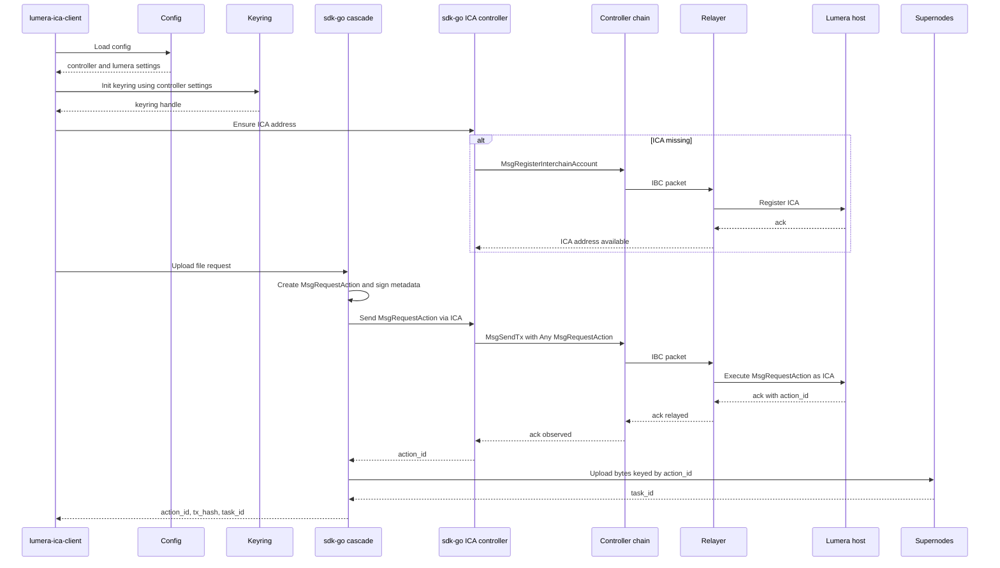

# Workflows: `lumera-ica-client` + `sdk-go`

This document describes the *current implementation* workflows in `lumera-ica-client`, and how the CLI integrates with `github.com/LumeraProtocol/sdk-go`.

For high-level protocol context, see:

- `../spec.md`
- `./DEVELOPER_GUIDE.md`

---

## 1. Key & Keyring Management (High Priority)

### 1.1 Single Keyring model (as implemented)

`lumera-ica-client` uses a **single Cosmos SDK keyring** instance for all workflows.

- The keyring is created once using the **`[controller]` keyring settings**.
- That same keyring instance is then reused for:
  - **Signing controller-chain ICA transactions** (e.g. ICA registration and `MsgSendTx`).
  - **Signing Cascade metadata** (application-level signatures embedded in action metadata).
  - **Deriving bech32 addresses** used by the SDK for both controller and Lumera identities.

This design is visible in [`client.NewCascadeClient()`](../client/cascade_client.go:29), which constructs the keyring and passes it into `sdk-go` clients.

> There is no separate Lumera-specific keyring. The only keyring configuration comes from the `[controller]` section.

### 1.2 Key roles: Controller Key == App Key

The current implementation intentionally uses a **single-key model for ICA workflows**:

- **Controller Key** (controller-chain key)
  - Configured by `controller.key_name`.
  - Used to sign controller-chain transactions required for ICS-27:
    - ICA registration (`MsgRegisterInterchainAccount`)
    - ICA execution (`MsgSendTx` carrying Lumera messages)
  - **Also used as the App Key**, meaning:
    - The same private key is used to sign metadata that the Lumera Action module verifies.
    - The public key bytes of this key are provided as `app_pubkey` on `MsgRequestAction`.

This is surfaced by [`client.NewICAController()`](../client/ica_controller.go:25), which passes `controller.key_name` into `sdk-go` ICA controller config, and by [`client.Controller.AppPubkey()`](../client/ica_controller.go:92) which exposes the **controller key pubkey bytes**.

### 1.3 Two key names, one keyring (controller vs lumera)

Even though the implementation uses a single keyring, it supports referencing **two key names** inside that keyring:

- `controller.key_name` (controller-chain owner key; also the App Key)
- `lumera.key_name` (used to derive a Lumera bech32 address passed into the Cascade SDK)

Both key names must exist in the same underlying keyring created from controller settings.

You can run with a single key by setting `lumera.key_name == controller.key_name`, but it is not required by the code.

### 1.4 `config.toml` fields that control keyring + key selection

Keyring selection is driven by `[controller]`:

```toml
[controller]
key_name = "osmosis-ibc-test"
keyring_backend = "os"   # os | file | test

# Required only for file backend
# keyring_dir = "~/.osmosisd"

# Optional: passphrase source (choose at most one)
# keyring_passphrase_plain = "..."
# keyring_passphrase_file = "/path/to/passphrase.txt"
```

Notes based on the implementation in [`client.LoadConfig()`](../client/config.go:50) and [`newControllerKeyring()`](../client/cascade_client.go:66):

- `controller.keyring_backend` must be one of: `os`, `file`, `test`.
- If `controller.keyring_backend == file`, then `controller.keyring_dir` is required.
- If `controller.keyring_backend == test` and `controller.keyring_dir` is unset, the code falls back to `controller.home`.
- Passphrase handling:
  - Set **either** `controller.keyring_passphrase_plain` **or** `controller.keyring_passphrase_file`.
  - If neither is set, `keyring` may prompt (backend-dependent).

The Lumera key name is configured separately:

```toml
[lumera]
key_name = "lumera"
```

### 1.5 How `sdk-go` derives `app_pubkey`

`sdk-go` derives the `app_pubkey` from the **same local controller key** used to sign ICA transactions.

In this repo:

1. [`client.NewICAController()`](../client/ica_controller.go:25) constructs a `sdk-go` ICA controller using:
   - the shared keyring instance
   - `controller.key_name`
2. The ICA controller exposes the controller key’s public key bytes via [`client.Controller.AppPubkey()`](../client/ica_controller.go:92).
3. The upload workflow passes those bytes into the Cascade upload call via [`cascade.WithAppPubkey()`](../cmd/upload.go:106).
4. `sdk-go` places that value onto `MsgRequestAction.app_pubkey` for ICA-created actions.

The resulting semantics match the intent described in `../spec.md`: under ICA, the *host-chain signer* is the ICA account, while the *application-level signer* is the controller key whose pubkey is carried as `app_pubkey`.

---

## 2. Core Workflows

### 2.1 Upload Workflow (register via ICA, then upload bytes)

**CLI entry point:** [`newUploadCmd()`](../cmd/upload.go:20)

This is the main end-to-end workflow:

1. **CLI parses inputs** and loads config via [`app.loadConfig()`](../cmd/commands.go:42) → [`client.LoadConfig()`](../client/config.go:50).
2. **SDK client init** via [`client.NewCascadeClient()`](../client/cascade_client.go:29):
   - Builds the controller keyring (`[controller]` settings).
   - Derives controller owner address and Lumera bech32 address.
   - Constructs a `sdk-go/cascade` client.
3. **ICA setup/check** via [`client.NewICAController()`](../client/ica_controller.go:25) + [`client.Controller.EnsureICAAddress()`](../client/ica_controller.go:101):
   - Queries whether an ICA exists for `(owner, connection_id)`.
   - If missing, registers the ICA and waits until the ICA address is available.
4. **Message construction (sdk-go)**:
   - `sdk-go/cascade` creates a `MsgRequestAction`.
   - `creator` is set to the **ICA address** (via [`cascade.WithICACreatorAddress()`](../cmd/upload.go:105)).
   - `app_pubkey` is set to the **controller key pubkey bytes** (via [`cascade.WithAppPubkey()`](../cmd/upload.go:106)).
   - Metadata is signed using the same controller key (App Key).
5. **Send over ICA (control-plane)**:
   - The CLI provides an ICA send hook via [`cascade.WithICASendFunc()`](../cmd/upload.go:107).
   - That hook delegates to [`client.Controller.SendRequestAction()`](../client/ica_controller.go:117), which submits a controller-chain `MsgSendTx` and waits for the IBC acknowledgement.
6. **Ack handling**:
   - `sdk-go` extracts `action_id` from the host-chain execution result carried in the ack.
7. **Upload to SuperNodes (data-plane)**:
   - After `action_id` is known, the file bytes are uploaded to SuperNodes keyed by that `action_id`.
8. **CLI emits result** containing `action_id`, `tx_hash`, `task_id`, `ica_address`, and `ica_owner_address`.

#### Sequence diagram (register + upload)



#### Variant: Upload bytes for an existing action (`--action-id`)

If `--action-id` is provided, the CLI skips ICA registration and action creation:

1. Query the action via [`client.NewLumeraClient()`](../client/lumera_client.go:15) and `Action.GetAction`.
2. Ensure the action is still pending.
3. Upload bytes directly via [`cascade.Client.UploadToSupernode()`](../cmd/upload.go:70), using `action.Creator` as the signer value passed to the SDK.

### 2.2 Approve Workflow (approve via ICA)

**CLI entry point:** [`newActionApproveCmd()`](../cmd/action.go:26)

1. Load config via [`app.loadConfig()`](../cmd/commands.go:42).
2. Initialize SDK clients via [`client.NewCascadeClient()`](../client/cascade_client.go:29) and [`client.NewICAController()`](../client/ica_controller.go:25).
3. Resolve the ICA address:
   - If `--ica-address` is provided, use it.
   - Otherwise, query via [`client.Controller.ICAAddress()`](../client/ica_controller.go:109).
4. Build the Lumera approve message with `sdk-go` via [`cascade.CreateApproveActionMessage()`](../cmd/action.go:67), setting `creator = ica_address` via [`cascade.WithApproveCreator()`](../cmd/action.go:67).
5. Submit over ICA via [`client.Controller.SendApproveAction()`](../client/ica_controller.go:125) (controller-chain `MsgSendTx` → IBC → host execution → ack).
6. CLI returns a JSON payload including `tx_hash`, `action_id`, and the resolved ICA addresses.

### 2.3 Download Workflow (download bytes from SuperNodes)

**CLI entry point:** [`newDownloadCmd()`](../cmd/download.go:16)

1. Load config via [`app.loadConfig()`](../cmd/commands.go:42).
2. Initialize SDK clients via [`client.NewCascadeClient()`](../client/cascade_client.go:29).
3. Initialize ICA controller via [`client.NewICAController()`](../client/ica_controller.go:25) **only to derive the controller owner address**.
4. Start the download via [`cascade.Client.Download()`](../cmd/download.go:55).

**Important signer detail:**

The download request is signed using the **controller owner address** (derived from `controller.key_name` + `controller.account_hrp`), not the ICA address. The CLI passes this explicitly via [`cascade.WithDownloadSignerAddress()`](../cmd/download.go:55) with [`client.Controller.OwnerAddress()`](../client/ica_controller.go:84).

---

## 3. `sdk-go` Integration Points

This section lists the primary `sdk-go` packages and the places where `lumera-ica-client` integrates with them.

### 3.1 Packages

- `github.com/LumeraProtocol/sdk-go/cascade`
  - Cascade workflow orchestration: build messages, upload to SuperNodes, download from SuperNodes.
- `github.com/LumeraProtocol/sdk-go/ica`
  - ICS-27 controller logic: ensure ICA, wrap host messages in `MsgSendTx`, broadcast, and wait for ack.
- `github.com/LumeraProtocol/sdk-go/blockchain`
  - gRPC query clients (used here for Lumera action queries and status lookups).
- `github.com/LumeraProtocol/sdk-go/pkg/crypto`
  - Keyring + address derivation helpers.
- `github.com/LumeraProtocol/sdk-go/types`
  - Shared types used in results and decoded action metadata.

### 3.2 Key functions and call sites in this repo

| Integration | Where it’s used | Purpose |
| --- | --- | --- |
| [`cascade.New()`](../client/cascade_client.go:49) | [`client.NewCascadeClient()`](../client/cascade_client.go:29) | Construct Cascade SDK client using Lumera RPC/GRPC + shared keyring |
| `sdk-go/pkg/crypto.NewKeyring` | [`newControllerKeyring()`](../client/cascade_client.go:66) | Create the single keyring instance (backend, dir, passphrase) |
| `sdk-go/pkg/crypto.AddressFromKey` | [`client.NewCascadeClient()`](../client/cascade_client.go:29) | Derive controller owner address and Lumera bech32 address from the keyring |
| [`ica.NewController()`](../client/ica_controller.go:61) | [`client.NewICAController()`](../client/ica_controller.go:25) | Construct ICA controller client (controller + host configs, keyring, connection id) |
| `(*ica.Controller).EnsureICAAddress` | [`client.Controller.EnsureICAAddress()`](../client/ica_controller.go:101) | Query/register ICA and return the ICA address |
| `(*cascade.Client).Upload` | [`newUploadCmd()`](../cmd/upload.go:20) | Orchestrate request action registration via ICA and then upload bytes |
| `(*cascade.Client).UploadToSupernode` | [`newUploadCmd()`](../cmd/upload.go:20) | Upload bytes only (when `--action-id` is provided) |
| [`cascade.CreateApproveActionMessage()`](../cmd/action.go:67) | [`newActionApproveCmd()`](../cmd/action.go:26) | Build `MsgApproveAction` with `creator = ICA address` |
| `(*ica.Controller).SendRequestAction` | [`client.Controller.SendRequestAction()`](../client/ica_controller.go:117) | Send `MsgRequestAction` via ICS-27 and return ack-parsed result |
| `(*ica.Controller).SendApproveAction` | [`client.Controller.SendApproveAction()`](../client/ica_controller.go:125) | Send `MsgApproveAction` via ICS-27 |
| `(*cascade.Client).Download` | [`newDownloadCmd()`](../cmd/download.go:16) | Download bytes from SuperNodes |

### 3.3 Internal ICA send and ack mechanics (sdk-go)

While `lumera-ica-client` interacts with `sdk-go` through high-level methods like `SendRequestAction` and `Upload`, the underlying mechanism is:

1. Pack one or more host-chain messages (e.g., `MsgRequestAction`, `MsgApproveAction`) into protobuf `Any`.
2. Submit a controller-chain ICS-27 `MsgSendTx` signed by `controller.key_name`.
3. Wait for the IBC acknowledgement.
4. For request actions, parse the host-chain response data to extract `action_id`.

In `sdk-go` this is implemented by internal helpers (for example, a method commonly named `sendICAAnysWithAck`) inside the ICA controller.

